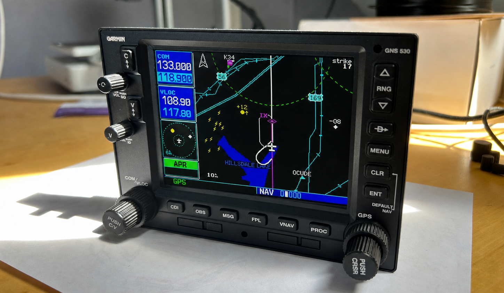

# GNS 530 Flight-Simulator GPS

A DIY Garmin GNS 530-inspired panel for flight simulation, designed for use with [MobiFlight](https://www.mobiflight.com/). The project includes a Raspberry Pi Pico, custom PCB, a 5-inch LCD, a printed and laser-engraved enclosure, Mobiflight configuration.

> [!IMPORTANT]
> This is an unofficial hobby project for flight simulation. It is not certified
> for aviation use and is not affiliated with or endorsed by Garmin.

## Features

- COM/VLOC and GPS dual-concentric encoders
- Illuminated GNS 530 controls
- 5-inch 640 x 480 display with HDMI, VGA, and composite-video input
- Adjustable panel illumination
- Editable KiCad and FreeCAD sources
- Printable parts, laser artwork, schematic, BOM, and PCB fabrication files

## Repository contents

| Folder | Contents |
|---|---|
| [`pcb`](pcb) | KiCad source, schematic, BOM, fabrication archive, display references, and assembly notes |
| [`mechanical`](mechanical) | FreeCAD source, printable parts, hardware, painting, and laser settings |
| [`mobiflight`](mobiflight) | Pico module configuration and Microsoft Flight Simulator project |

## What you need

- The components in the [PCB bill of materials](pcb/README.md#bill-of-materials)
- The printed parts and GNS530-specific [mounting hardware](mechanical/README.md#hardware)
- PCB800099 video controller and ZJ050NA-08C 5-inch LCD
- 12 V DC power supply rated above 1 A for the video controller
- Raspberry Pi Pico, MobiFlight

## Build documentation

1. Manufacture and assemble the board using the [PCB guide](pcb).
2. Print, paint, engrave, and assemble the enclosure using the
   [mechanical guide](mechanical).
3. Use the official MobiFlight documentation for
   [board configurations](https://docs.mobiflight.com/features/file-types/),
   [projects](https://docs.mobiflight.com/features/projects/), and
   [controller bindings](https://docs.mobiflight.com/features/controller-bindings/).

The supplied MobiFlight files are [`GNS530.mfmc`](mobiflight/GNS530.mfmc) and
[`GNS530.mfproj`](mobiflight/GNS530.mfproj).

## Licence

Original project material is licensed under
[CC BY-NC-SA 4.0](https://creativecommons.org/licenses/by-nc-sa/4.0/).
Third-party material and trademarks remain the property of their owners.
