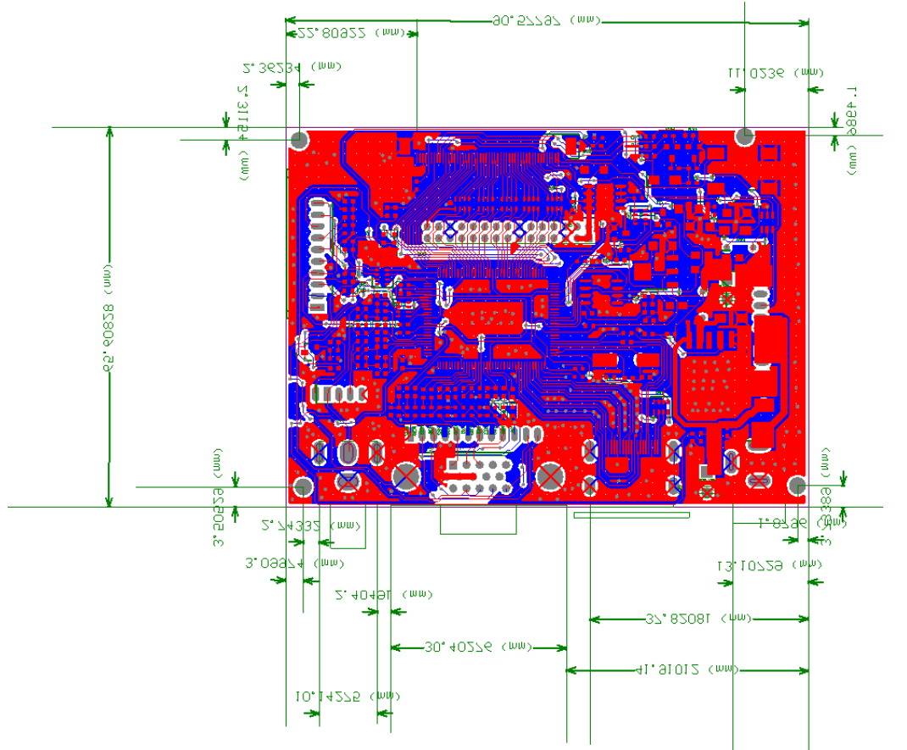

# PCB

## PCB manufacturing

The ready-to-order fabrication archive is
[`GNS530_v1_1_pcb_fab.zip`](GNS530_v1_1_pcb_fab.zip). Use a standard board
thickness of **1.6 mm**.

- [KiCad project](GNS530.kicad_pro)
- [Schematic PDF](GNS530_schematic.pdf)

The local symbol and footprint libraries are referenced through `${KIPRJMOD}`.

## Bill of materials

| Designators | Qty | Component | Specification |
|---|---:|---|---|
| RE_GPS1, RE_COM_VLOC1 | 2 | Dual-concentric encoder | PEC11D-4120F-S0015 |
| Q2 | 1 | P-channel MOSFET | AO3401A, SOT-23 |
| C1 | 1 | Capacitor | 0.1 uF, 1206 |
| R1-R23, R32-R36 | 28 | Resistor | 220 ohm, 1206 |
| R24-R31, R39, R40 | 10 | Resistor | 10 kohm, 1206 |
| Q1 | 1 | NPN transistor | BC847, SOT-23 |
| SW_CDI1, SW_CLR1, SW_COM1, SW_DCT1, SW_ENT1, SW_FPL1, SW_MENU1, SW_MSG1, SW_OBS1, SW_PROC1, SW_RNG_D1, SW_RNG_UP1, SW_V1, SW_VNAV1 | 14 | Illuminated tactile switch | 6 x 6 x 7.2 mm, six pins |
| D1-D14 | 14 | LED | 3 mm clear through-hole |
| U1 | 1 | Shift register | 74HC165, SOIC-16 |
| RE_VOL_COM1, RE_VOL_V1 | 2 | Rotary encoder with switch | PEC11L-4220F-S0015 |
| EXT_LED1 | 1 | Two-pin header | 2.54 mm pitch |
| A1 | 1 | Microcontroller | Raspberry Pi Pico |
| - | 2 | Male pin header | 20 pins, 2.54 mm pitch |
| - | 2 | Female socket header | 20 pins, 2.54 mm pitch |

## Illuminated switches

Use 6 x 6 x 7.2 mm, six-pin illuminated tactile switches. Four pins form the
duplicated switch contacts; the remaining two connect the LED.

The small square PCB pad is ground and connects to the negative LED terminal.

## Display

The enclosure is designed for a **PCB800099** HDMI/VGA/AV controller and
**ZJ050NA-08C** 5-inch 640 x 480 LCD.

| Part | Specification |
|---|---|
| PCB800099 controller | 100 x 55 x 10 mm; 12 V DC, more than 1 A |
| ZJ050NA-08C LCD | 117.65 x 88.43 x 5.9 mm; 50-pin parallel RGB |

- [Controller dimensions](../mechanical/display/PCB800099_dimensions.png)
- [Controller datasheet](../mechanical/display/PCB800099_datasheet.pdf)
- [LCD datasheet](../mechanical/display/ZJ050NA-08C_datasheet.pdf)
- [Controller product image](../mechanical/display/PCB800099_product.jpg)

The display controller uses its own 12 V supply. Do not connect 12 V to the Pico or the LCD panel input.

If your controller board includes VGA and composite-video connectors, desolder
them before assembly. Alternatively, modify the back cover to provide adequate
clearance for the connectors.
